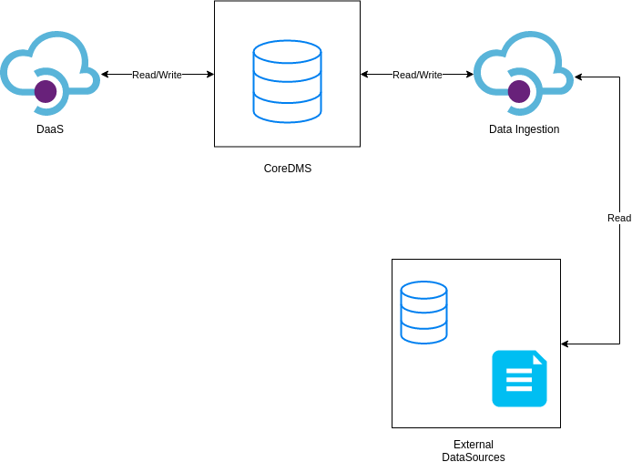
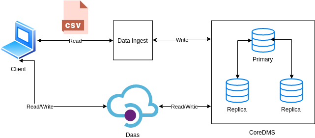
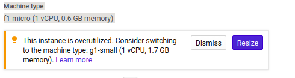

# Design


### Part1

There are two design proposal.
- one is design which should use and describe as follows.
- Second which is implemented and have some shortcomings.


**1)** There are three main components of this architecture which are coredms, daas and data ingestion. While coredms is a central component which will be consist of a database. Daas will be serve as a Function as a service module which can write and read directly from coredms in a scaleable fashion. While dataIngestion will work through data stream platform like Kafka to read/write data to coredms and external data sources respectively.



Some points for above design:

- CoreDms is storage and should be elastic fault-intolerance and scalable
- Daas is a service from which we can read/write data directly into CoreDms
- DataIngest is a to copy external data source from/to Coredms


**2)** For the whole system to work, there should be single instances of service be up every time which could be done by applying load balancer before Daas and DataIngest service. For CoreDms we need 2 nodes which work as Master-slave nodes. In Mongo Db, there is a concept of replication which provides us fault intolerance and scalability which is critical for this component.

**3)** I will be using VM for the following reasons:

- VM is more secure than container
- It can be a Horizontal Scale which is always better than vertical scaling in case of containers
- Cloud Services provides click and deploy feature which could help me to spend less time in configuration


**4)** I will be using Apache Kafka which is basically a pub-sub queue, which helps to remove the bottleneck from both CoreDms and DataIngestion. Moreover, with larger request, CoreDms will scale automatically with new instances, and with Kafka queue, we will not have a load in between connection of these two components.

**Note** :

For development in question 2, I just use a simple script to do dataIngestion

**5)** For current project following are the motivations to choose Industrial cloud Infrastructure:

- Not enough expertise to manage the network operations of the systems
- It is cost-effective rather than building it on-premise
- Easy to deploy and manage
- The dataset is open which doesn&#39;t require any security which in-premise provides.
- Don't have to worry about scalability and elasticity of the services


### Part2

Part 2 of assignment is done and implemented w.r.t to following design




With VM configuration as follows:




**1)** As we are using NoSql as a data source for our forms, there will be no proper schema. However, the columns of the dataset will be the fields of documents in a single collection.

Sample:
```json
{
        "App" : "FlipaClip - Cartoon animation",
        "Category" : "ART_AND_DESIGN",
        "Rating" : 4.3,
        "Reviews" : 194216,
        "Size" : "39M",
        "Installs" : "5,000,000+",
        "Type" : "Free",
        "Price" : 0,
        "Content Rating" : "Everyone",
        "Genres" : "Art & Design",
        "Last Updated" : "August 3, 2018",
        "Current Ver" : "2.2.5",
        "Android Ver" : "4.0.3 and up"
}
```

Schema
```
App string
Category string
Rating string
Reviews string
Size string
Installs string
Type string
Price string
Content Rating string
Genres string
Last Updated string
Current Ver string
Android Ver string
```

**2)** The dataset I used is &quot;Google Play Store Apps&quot;, in which there are two fields which could be used to shard data. One is &quot; **Type**&quot; which simply divides the data into two parts &quot;Free&quot; and &quot;paid&quot;, while other is &quot; **Content Rating**&quot; which provide information of the target audience group. This way we can boost our read while having a sharded database for targeted needs.

**3)** DataIngest is a developed with Python Script with the use of MongoDB API to ingest data from an external source(CSV). Execution and deployment details are in Depoyment file

