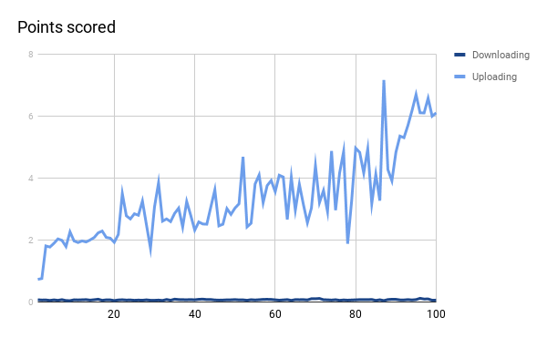
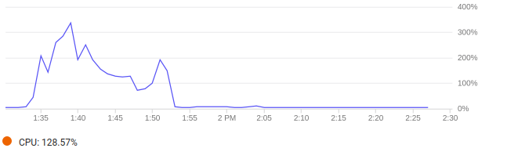
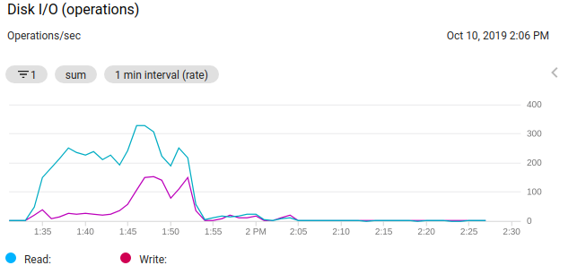
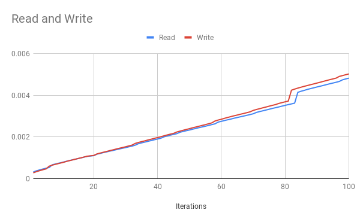
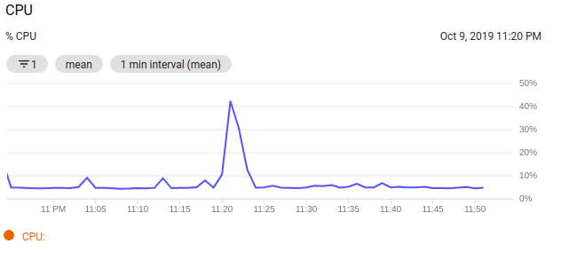
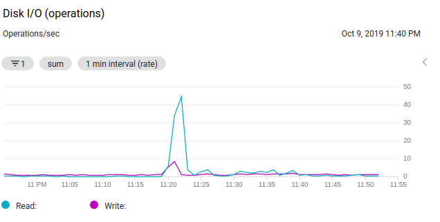

# Report


### Data Ingestion Report

**4)** To test I use **testmydataingest.py** with a bash script to spawn a parallel process. Following are the chart results for uploading and downloading data with **n** number of process.



**Note** :

The read is tested with same amount of records, as read time increases with the increase of data in a database.

The graph shows flat results because of the parallel process and usage of batch processing within a DataIngest. It doesn&#39;t matter who many processes you spawn the results will be the same unless the CoreDms remain stable that is doesn&#39;t run out of resources and scale accordingly.

The following graphs will show the load on CPU and Disk of CoreDms:

 
 
 
With more than 100 processes for writing from DataIngest, some of the process failed due to the following warning:

```
The master 0 ran at 300% CPU utilization.
```

Due to high utilization of CPU, the process start to stackup which impact my remote machine as they are getting pile up it take up my resources and on cloud the VM start to take a load which is distributed among replicas but still not enough to handle incoming traffic

While for reading (base record counts of CSV), we can see that it didn't effect much because of a replica nodes the load distibuted accordingly.

**5)** There are many reasons for downgrading performance due to the current environment, but mostly because of the resources in hand.

- As I am using my own personal machine to run data ingest thus the number of processes is limited due to resource constraint.
- Secondly, the mongo instance is running on the least instance configuration by GCP which has very limited resources thus the load is much more for the resources in hand.

The main problem is with resources, which can be done by scaling CoreDms both horizontally and vertically to handle the load. For the CPU utilization issue, we need to have a load balancer before CoreDMS which can easily scale our CoreDMS on metrics like CPU and memory utilization. Moreover, the DataIngest script should also be deployed to the cloud to control its scalability and boost its performance


###Daas Report

The read is tested on actual dataset record counts and with **n=100** threads of requests runing parallely. As you can see from below picture the time is increasing with each count but the increase is exponentially minimal. It can also observe that write takes a bit mroe time than read but the pattern follows same as read. The write is also done one record on each request call.
 


As from below picture we can see load on Mongo instance starts to increase with high number of requests



