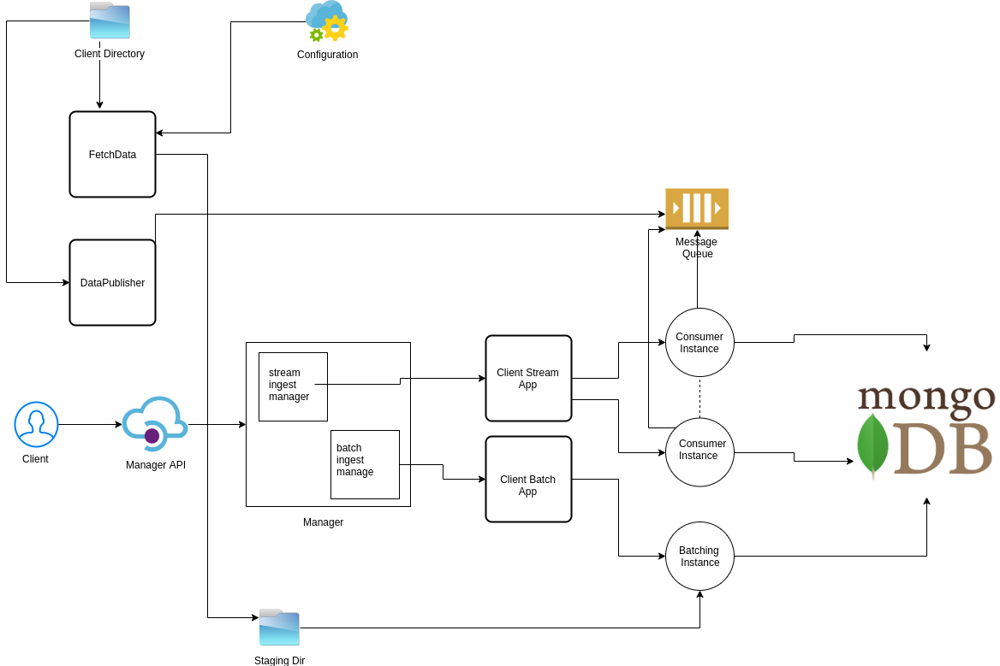

# Design

### Part3

Over all architecture of this assignment module is as follows, please read below for proper understanding(Image is an overview of architecture):

There are two major parts of the design
- Client side control
- MySimBdp Server

##### Client Side Control

This assignment provide concept of multi tenancy and provide some control to the organziation using our big data platform. Which includes allow client to uplaod their data and custom script using our API to load data inot our CoreDMS

The are two scripts under **clientSideApp** which will be provided to client to execute two functionality which respect client data privacy policy

- **mysimbpd-fetchdata.py** which will fetch data files, apply constraints by getting configuration on run time from mysimbdp server and push to to staging directory
- **data_publisher** which will publish data to our streatming queue, a single queue will be assign to a single tenant. This script burst out a file data into messages

Moreover, the client(tenant) can access manager API which can run clients provided applciation either batch or stream. Furthermore, there are extra API like monitor API which can provide report of streaming metrics and can list staged data files

##### MySimBdp Server

This is a core component for this assignment, we are reusing CoreDMS from previous assignment which is deployed at GCP.
Please use follow creds and replace them in a script to run the system. As the creds remain in our server script they are safe.
- IP: 34.69.192.142:27017
- User: root
- Password: FoSezeYin7Qr

This server handle for following responsibilities:

- Exposing congifuration end point which can impose client based restrictions on fetch data method
- Exposing manager API, which provide access to a client to run its script namely clientbatchingestapp and clientstreamingestapp
- Exposing API to check system health, monitor stream metrics and find stagged files.
- Each tenant can only access their applications and platform metrics
- Execute data ingestion w.r.t clients application which is tailored with provided instructions

###### Client Scripts Instructions

There are certain instructions and modeling a client should follow when developing their scripts

 **For Batch Ingest**
 - A client need to use Mongo API and python3, more specifically pyMongo to write its script
 - Client should create a method called **write_csv_to_db** which should take **client** and **path** parameters as input and utilize client to sink data into CoreDMS
 - Mongo client will be passed by managerBatchIngest.
 

 **For Stream Ingest**
 - A client need to use RabbitMQ API and python3, more specifically pika to write its script
 - Client should create a method called **start** which should take **client** and **tenant_id** parameters as input and utilize client to sink data into CoreDMS through a queue named w.r.t tenant
 - Client should place start method on new process in background which allow stream manager to spawn new consumer instances on demand
 - Client should create a method called **stop** to stop a consumer instance
 
 
 ###### Managers

The two managers are exposed to different endpoints, which provide control to a tenant to execute their script on demand

- Batch manager, is an endpoint which will execute client script using its data file as input and then insert data with batch API of Mongo which handle spliting and queuing data by its internal implementation. According to (https://api.mongodb.com/python/current/api/pymongo/collection.html#pymongo.collection.Collection.insert_many), pyMongo a python Library does all the necessary chunking of data to fit database needs.
- Stream manager, is an endpoint which will create a new instance of a consumer which can consume a tenant queue. On each request a new consumer will spawn. With this manager you can also stop old instances. A handy tool for montioring is also there whcih will provide detailed report on the producer and consumer for the provided queue.

**Q)3.3**

The platform work as a IaaS which just need a file to execute and should concern what and why it is executing it, but with certain constraints define. The main reason is to respect privacy policies of data and client integration. Other than that, with defined constraints an Iaas provider should need to know a busienss logic underneath the client applications.
On contrast, the more dependencies a client provide on platform the more it need a context of client applications. For dynamic decision a platform should know what is the business logic or what is the context of an application on which it can change its Infrastructure changes.

**Q)3.4**

The platform can provide a check on quality on data while keeping the privacy policy intact. It just need some information from client on data model and constraints of its parameter to make sure only a correct and validate data should be ingested into a system. Some example are as follows:

- A client can provide a schema of a data need to be inserted so a platform can only allow data validating this schema
- A client can provide an archiving policy which allow to remove stale and idel data
- A platform can check for inconsistent and empty fields within data to avoid sparcity

**Q)3.5**

With current implementation of my big data platform we need to pass the versioning of file name of these client application to fetch the correct version before executing them. But they still need to follow certain insturcutions without which a platform never know what to execut from these apps.
