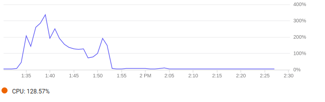
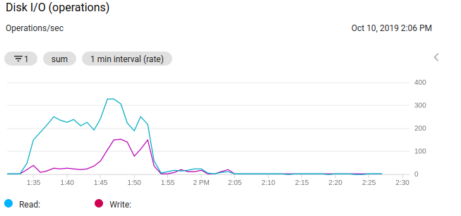
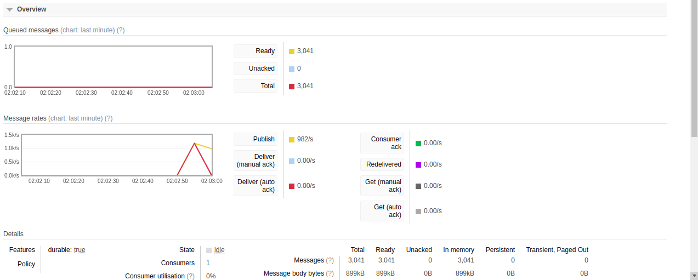
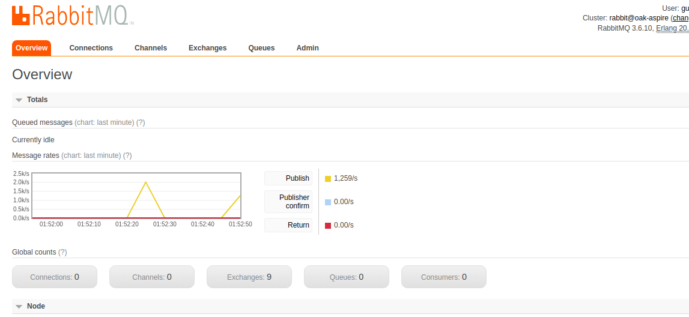

# Report

### Client Batch report

The read is tested with same amount of records, as read time increases with the increase of data in a database.

The graph shows flat results because of the parallel process and usage of batch processing within a DataIngest. It doesn&#39;t matter who many processes you spawn the results will be the same unless the CoreDms remain stable that is doesn&#39;t run out of resources and scale accordingly.

The following graphs will show the load on CPU and Disk of CoreDms:

 
 
 

### Client Stream Report

Below is the stream overview of messages and rates published by data publisher with google dataset

Below is the queue metrics on a sinlge point of time defining the message on flight and in a queue. It also show delieved message which mean consumption.

RabbitMQ is used as it provide a basic dicumentation to apply pub/sub queue with worker nodes which is needed in this assignement, moreover it dashboard can provide a better understanding of viewing the flow of messages and monitor the metrics 