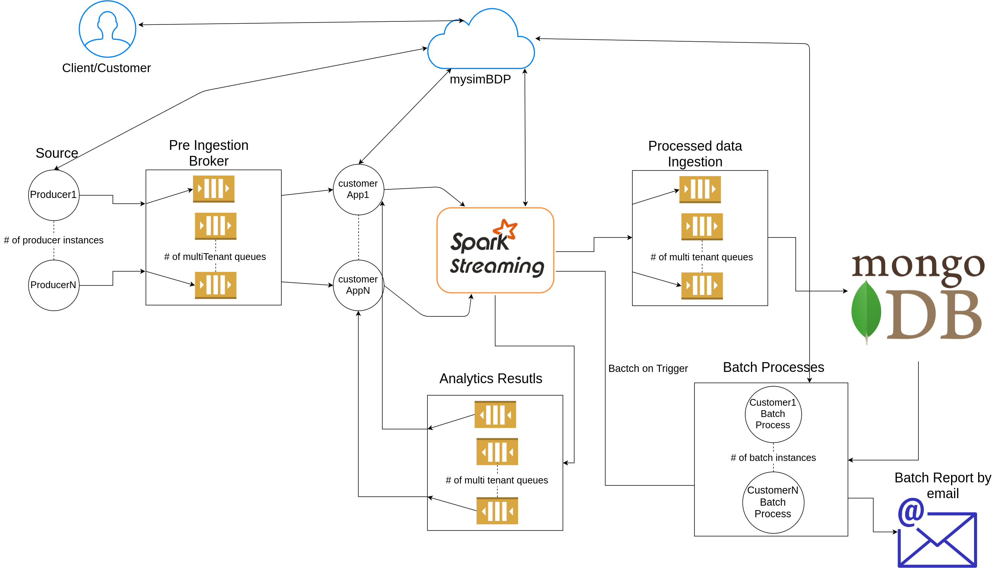
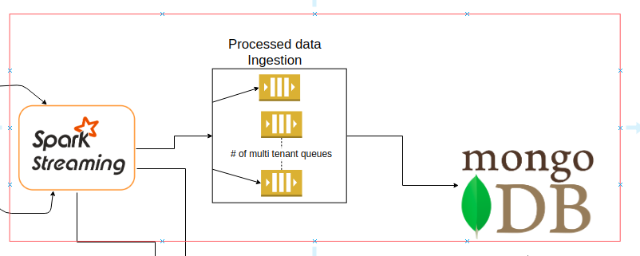
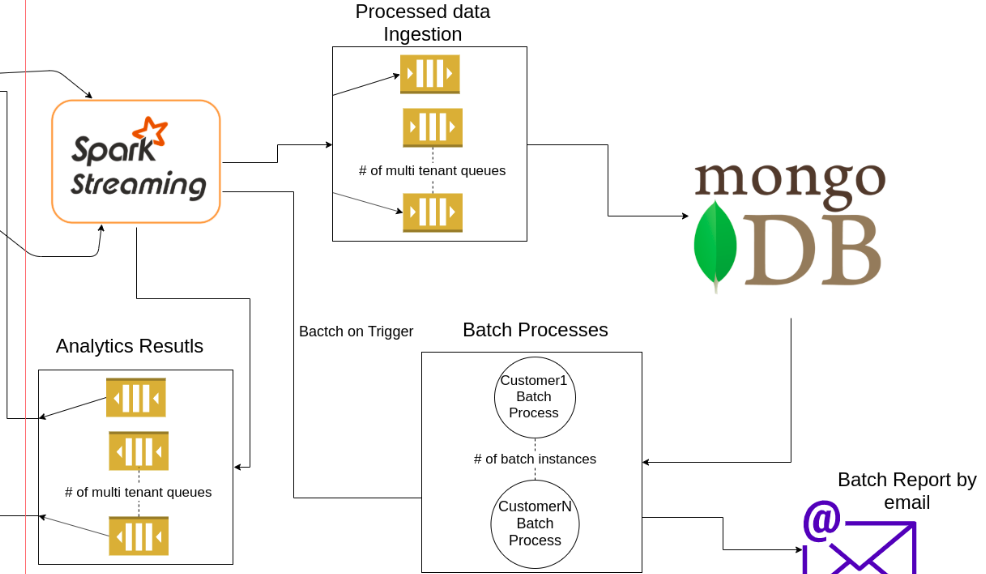

# Design


Over all architecture of this assignment module is as follows, please read below for proper understanding(Image is an overview of architecture):



There are two major parts of the design
- Stream processing
- Batch processing


#### Dataset

I choose BTS monitoring dataset for this assignment, as it is an event based data collected from some IoT devices which makes it an ideal data to do stream analytics. 
The structure of data as follows:

- station_id: the id of the stations
- datapoint_id: the id of the sensor (data point)
- alarm_id: the id of the alarm
- event_time: the time at which the event occurs
- value: the value of the measurement of the datapoint
- valueThreshold: the threshold set for the alarm. Note that some threshold values are set to a default value of 999999.
- isActive: the alarm is active (true ) or not (false)
- storedtime: no store

The data is collected from some kind of IoT devices which is collected from different stations fetching different readings and based on these reading there are certain threshold which if reached OR if the device starts to malfunction the alarm will trigger.

The key points for using this dataset are:

- Event and timebased data, which will help to set up a window function on a stream
- Triggers are defined in a form of Alaram which can be used to envoke batch methods for further reporting
- Threshold value already provided to compare and to calculate alarm status
- Vertically spread data which can help to simulate a stream

###### Customer Analytics on DataSet

- Stream analytics can be done to group station id, datapoint_id and alaram id which can provide a aggregate values of how many times an alaram raise for each senor from different stations
- Batch analytics of above results can be provided to look over how many these alarams are raised periodically (i.e daily, weekly and monthly)

#### Keyed/Non-Keyed data streams and Dilevery Gurantee

To have parallelism we need to have a Keyed data stream to split an unbound stream into logical keyed streams.  any attribute of your incoming events can be used as a key. Having a keyed stream will allow your windowed computation to be performed in parallel by multiple tasks, as each logical keyed stream can be processed independently from the rest. All elements referring to the same key will be sent to the same parallel task.

For this assignement the dilevery gurantee can have two different contexts. As we are using two different tools, which are Messaging queues and Streaming framework. A gurantee provided by a Messaging queues broker are Message gurantee which make sure if the message can deliver from the source to sink, while streaming framework proivde a processing gurantee which related if the message will get processed by a framework from source to sink.
To guarantee end-to-end exactly-once record delivery, both broker and stream framework need to be in sync and should choose "exactly once"  parameters in its configuration.

For the data we have we need a "exactly once" gurantee from broker as we dont need to loose any information while to make analytics more robust we can have "atleast once" mechanism as it can improve latency issues which other options starts to put on the system.


#### Time Association and Windows

There are three types of time associated with streaming process, in which only one (eventTime) is depends on data provided timestamp.

- **Processing time** Processing time refers to the system time of the machine that is executing the respective operation. When a streaming program runs on processing time, all time-based operations (like time windows) will use the system clock of the machines that run the respective operator.
- **Event time** Event time is the time that each individual event occurred on its producing device. This time is typically embedded within the records before they enter Flink, and that event timestamp can be extracted from each record 
- **Ingestion time** Ingestion time is the time that events enter Flink. At the source operator each record gets the source’s current time as a timestamp, and time-based operations (like time windows) refer to that timestamp. 
 
If data is not provided with a timestamp then we can use wither processing time or ingest time to control the window. Compared to processing time, it is slightly more expensive, but gives more predictable results. Because ingestion time uses stable timestamps (assigned once at the source), different window operations over the records will refer to the same timestamp, whereas in processing time each window operator may assign the record to a different window (based on the local system clock and any transport delay).
Compared to event time, ingestion time programs cannot handle any out-of-order events or late data, but the programs don’t have to specify how to generate watermarks.

For a current data set we will go for **Event time** as the dataset have **event_time** which comes from the system of customers itself.

Windows split the stream into “buckets” of finite size, over which we can apply computations. For example, with an event-time-based windowing strategy that creates non-overlapping (or tumbling) windows every 5 minutes and has an allowed lateness of 1 min, Flink will create a new window for the interval between 12:00 and 12:05 when the first element with a timestamp that falls into this interval arrives, and it will remove it when the watermark passes the 12:06 timestamp.

We will use tumbling windows for our use case as we need to count number of alarms triggered in certian amount of time to know the rate of alaram from these devices. A tumbling windows assigner assigns each element to a window of a specified window size. Tumbling windows have a fixed size and do not overlap. For example, if you specify a tumbling window with a size of 5 minutes, the current window will be evaluated and a new window will be started every five minutes.

#### Performance Metrics

Following are the metircs necessary for this use case:

- **Latency** Latency will be important parameter for our use case as we place window frame which need to calculates rate of alarams, and if due to latency dlayed events may biased pur result
- **Throughput** With latency, throughput is also necessary as the resources should be needed to compute all the events within the window frame and it should produce and processing delay. High throughput is the target
- **Resposne Time** Response is needed on batching process but this metirc is no critical as the batch happened periodically and doesn't need to be highly available
- **QoS** Quality of service we need to make our system highly avaliable and fault tolerance which is why we can use checkpoint mechanism and other methods to evaluate this metric. 


#### Architecture

Image on top can provide a clear view of how the architecture looks like, there different modules of this design which can be explain as follows:

- **mysimbdp** - A main server which is reused from previous assignment, it provide restful API to client/customer to perform operation to our big data platform. All the entry pioint for stream and batch analytics are present here and can be see in README file
- **CoreDMS** - A cloud based Mongo database which will store all customer information and for this assignment all its processed stream analytics which will/can be use for further insights and on demand bathc processing
- **Data Soruce (Producer)** - The data sources for this assignment will be a CSV files which need to be submitted through producer to be stream through myStreamServices to perform analytics on customerApp
- **Pre-Ingest Broker** - This broker is places between data source and customerAPP. It provide a prallelism from which a each Tenant customerApp will consume messages belongs their own sources and use myStreamService to perform analytics
- **CustomerApp** - Customer custom scripts which will be procssed through with our myStreamServcie which should follow some constraints on data modles and code paradigm.
- **myStreamService** - Our stream service will use Apache Flink which have all the methods need to solve this assignement and can provide streama nd batch mechanism
- **Processed Ingestion Broker** - This broker get all the processed data from flink of different Tenant providing multi tenancy and scalability and sink data into our CoreDMS by using our system core API which will store data in batch format to provide more efficient processing.
- **Analtics Results Broker** - These Message queues will return results processed through our myStreamService and transfer it to customerApp in a scalable manner. 
- **Batch Process** - This module is use for doing all the batch process with from myStreamServices which come as a trigger event or customer on demand request which will fetch historical data from CoreDMS and do insights on it.

This assignment provide concept of multi tenancy and provide some control to the organziation using our big data platform. Which includes allow client to uplaod their data and custom script using our API to load data inot our CoreDMS

**NOTE:**
This architecture is highly scalable, the only bottleneck is myStreamService which is based on flink.


### Part 2

#### Data Structure

The data which will be inserted should be in key value pairs, as the broker will route them on the basis of key parameters. The routing key will always me some tenant_id which will place integrity of multi-tenancy in a system. Following rules should be follow to push the data into any broker

**For producer**
- routing key -> tenant_id
- data -> json serialized string

**For customerAPP**
customerApp can fetch data on bellow parameter
- routing key -> tenant_id
- data -> json deserialized string into object

Sample data output for customerApp
```json
{
   'station_id':1161115016,
   'datapoint_id':121,
   'alarm_id':308,
   'event_time':'2017-02-18 18:28:05 UTC',
   'value':240,
   'valueThreshold':241,
   'isActive':true,
   'storedtime':''
}
```

This data can be inserted into flink and then the analytics output be as follows:
```json
{
   'station_id':1161115016,
   'datapoint_id':121,
   'alaram_fire_count':10
}
```

This above data will be insert into CoreDMS with respect to customer data. Batch analytics can provide data as follows:

```json
{
   'station_id':1161115016,
   'datapoint_id':121,
   'time_period': '12h'
   'alaram_fire_count':10
}
```


##### Key logics for the functions used

```python
lines = ssc.socketTextStream('localhost', <tenant_port>)
counts = lines.flatMap(lambda line:[line.get('value'), line.get('valueThreshold')])\
                    .filter(lambda word: word[4] > word[5])\
                    .map(lambda word : (word, 1))\
                    .reduceByKeyAndWindow(lambda a, b : a + b, 10, 2)
```

- **flatmap** Passing each element of the source DStream through a function, here the function is to get alaram value for each object coming from messages
- **filter** Selecting only the records of the source DStream on which func returns true. Here we are only concern with the alrams which are triggered due to value passed a threshold
- **map** map each result to 1, which will get aggregated in next step
- **reduceByKeyAndWindow** (K, V) pairs where the values for each key are aggregated using the given reduce function func over batches in a sliding window. Here we just aggregate all the alarms count


#### Parallelism settings

So the system is designed to provide Parallelism which comes up with multi tenancy and using Pub/Sub queue for each customer, the queue will handle and ensure that all messages will get processed and every customer have its own parallel queue which will not hurdle any other customer. More over all methods of myStreamService through spark stream are parallel in nature as they are atomic unit which also make this system parallel.
The issues occur within my test environement is a latency issue due to high use of resource, which means that the system requires a decent resource to process data.


#### Data to CoreDMS



Above image is from the architecture define at top, to store the proccessed data I implement a broker which will on sclae take data from the spark stream and then feed it into CoreDMS by using inhouse Mongo Batch API which will efficiently store data without any strain on Mongo instances

#### Batch Analysis



Again abive image is from architecture define at top. The batch customer app should be provided from the customer to do batching. The batch process in this system will be triggered in two ways:

- **onDemand** - Customer can use API from mySimBdp our Restfull server implemented from last assignment to deliver the batch results from the customer batch app 
- **onTrigger** - Customer can place trigger in there customerStreamApp which in our dataset case will be on **rate of alarm triggerd** and will execute a batch proccess if certain threshold reached

With each results computed by stream spark the customer will evaluate the result of each window wither there threshold and can initiate a batch instance if the value reach above threshold.
Although the email functionality is not implemented but it would be a good design to send the batch results through email, especially on triggered batch process. 


#### Scale UP

I design the architecture from start with scale out in mind. Each individual component is scalable if we want to increase the customer all the processes increases vertically. Like the Data source (producer) process scale from 1....N, similarly the broker queues will grow with each Tenant(Customer). Spark worker/process itself are distributed and parallel which is manage by the framework itself. The batch process is also initiated individual process for each tenant. Overall, all system is ready to scale up on demand :)

The only issue which may arise is the use of resources as the customer grow we need to increase our resource to make the system stable and available 

#### End-to-End Gurantee System

For this assignement the dilevery gurantee can have two different contexts. As we are using two different tools, which are Messaging queues and Streaming framework. A gurantee provided by a Messaging queues broker are Message gurantee which make sure if the message can deliver from the source to sink, while streaming framework proivde a processing gurantee which related if the message will get processed by a framework from source to sink.
To guarantee end-to-end exactly-once record delivery, both broker and stream framework need to be in sync and should choose "exactly once"  parameters in its configuration.

In my opinion, such system will have much more latency and have to wait on each process to gurantee message acknowldgement. While it can be possible as above mentioned method but it is not recommended undless if each and every message is critical.