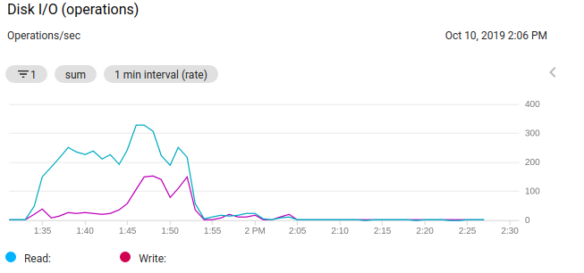
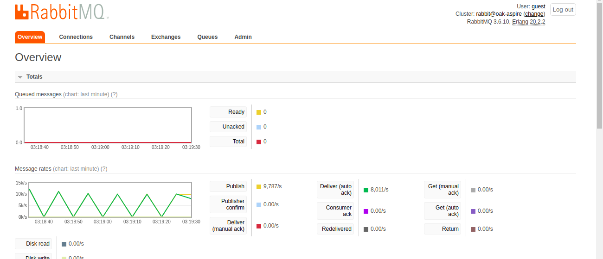
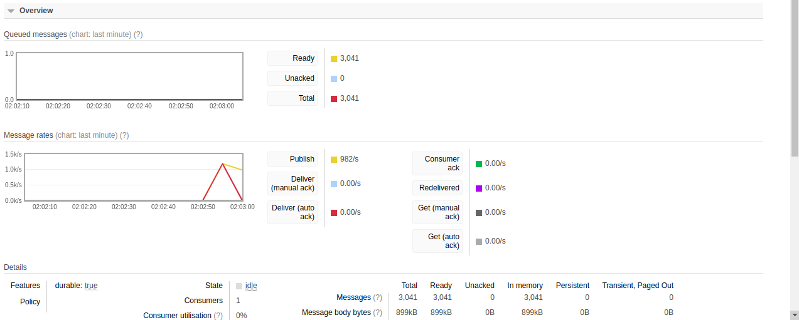
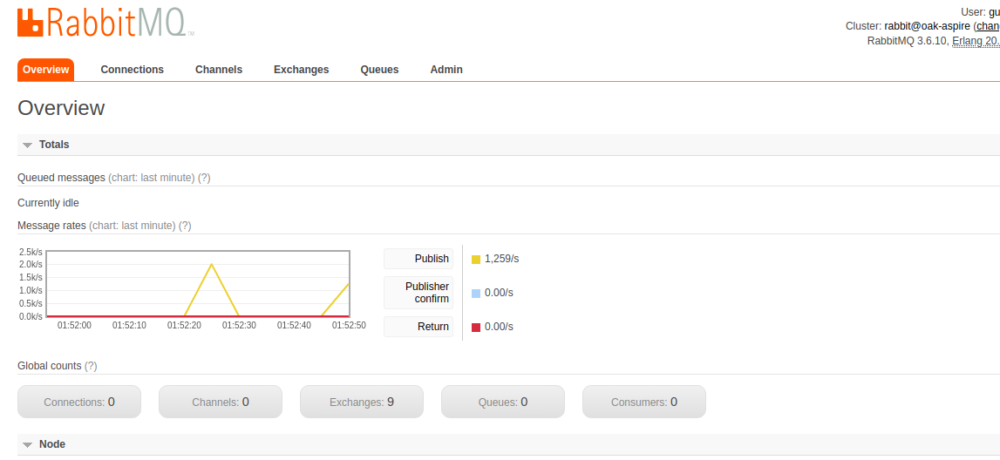
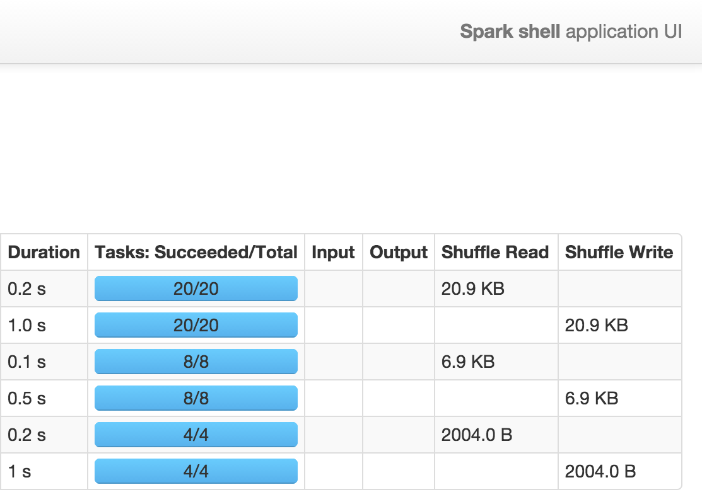

# Report

### Client Stream and Batch report

CoreDMS is only use to store the processed data which results in few number of records for each client, which result in almost no load on our CoreDMS with this assignment
The following graphs will show the load on CPU and Disk of CoreDms:

 
 

#### Client Stream Report

We have 3 brokers of AMQP from which the pre ingest broker and post ingest broker have loads. We can see below that the pre ingest broker results in high load as all the data is flow from the proucer to our system thorugh it.
Below is the stream overview of messages and rates published by data publisher with bts dataset

Below is the queue metrics on a sinlge point of time defining the message on flight and in a queue. It also show delieved message which mean consumption.

And finally spark UI shows the completed task of map reduce as follows:

RabbitMQ is used as it provide a basic documentation to apply pub/sub queue with worker nodes which is needed in this assignement, moreover it dashboard can provide a better understanding of viewing the flow of messages and monitor the metrics 

Logs for the process can be seen in the logs folder